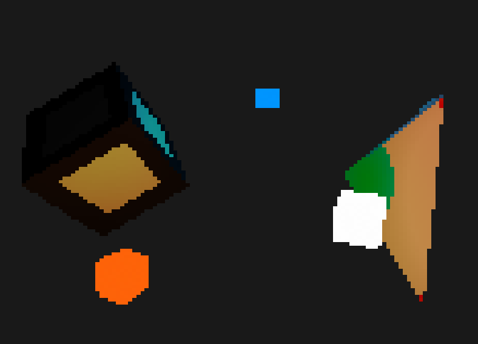
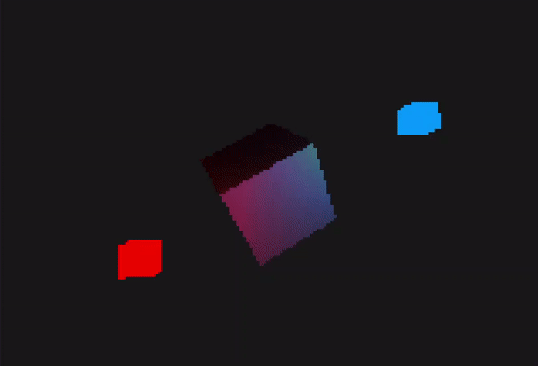
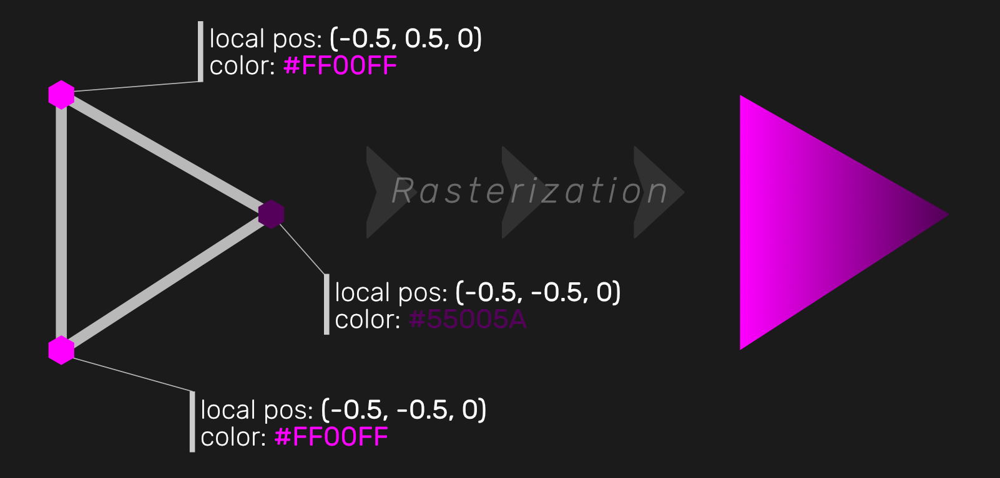
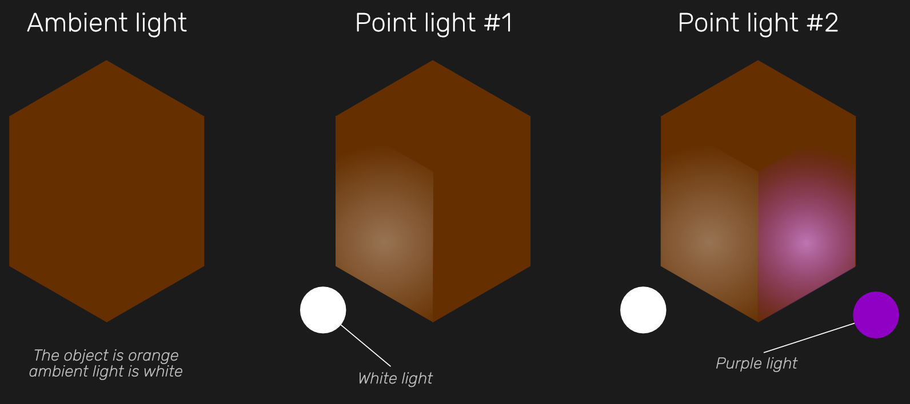
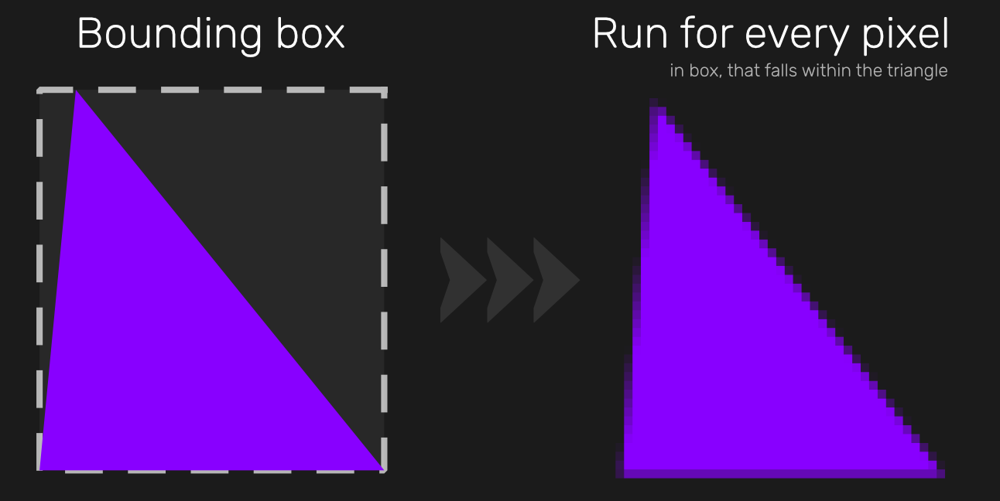
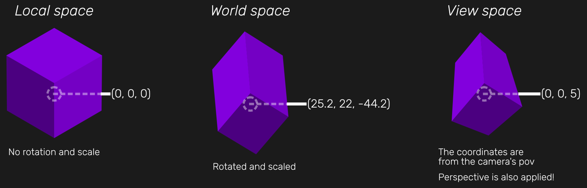

# Preview

  

<i>
An example of a some of the rendering features
</i>

    
  

<i>
Real time rendering examples, the second is a good example of light blending!
</i>

  

<i>
A more complex scene, using colored lights, advanced fragment shaders, and different meshes, rendered in real time
</i>

# Introduction
This is a proof-of-concept project, born to explore the problems of graphics rendering, while trying to emulate a simplified version of the OpenGL API.

The project uses the [openFrameworks](https://openframeworks.cc/) library to draw the rendered frames on screen (and for small utility types, like `ofColor` and the `glm` library shipped with the framework).

# Outline
openFrameworks allowed to treat the screen like a basic grid of pixels (through the `ofPixels` class) and to read keyboard and mouse input. 
While the framework is capable of much more than this, it wasn't used for anything else: the whole rendering process, from the computation of the mesh vertices all the way to the calculation of the colors of each individual pixel, were implemented from scratch.

# Limitations
As this is a CPU-based simulation of a GPU-based process, it is orders of magnitude slower than real rendering engines leveraging graphic APIs such as Vulkan, OpenGL and DirectX. The main reason for this difference is that GPUs have a much higher degree of parallelism than CPUs, so even with an hypotetical multithreaded implementation, this library could only become marginally faster (and it would still be much much slower than GPU rendering).

# The rendering pipeline
The basic components of _FakeGL_ are:
1. **Meshes**: defining the 3D models as sets of points in 3D space, grouped in triangles
2. **Shaders**: defining the computations required for the projection of 3D objects on a 2D screen and for the computation of pixel colors on said screen
3. **Renderers**: using the two types of components above to coordinate the outputs of rendering calculations applied to all of the meshes and shaders in a scene
4. **Cameras**: are required in the view space transformation step of the vertex shader computation

## Meshes
A mesh is characterized by two types of information:
- **Geometric data**: the vertices forming the triangles that make up each mesh
- **Vertex data**: the information bound to each vertex, such as: local space position, world space position, color and normals (used in light calculations, they represent the direction a vertex is "facing". The normal of a triangle is the average of the normals of it's vertices)

The `VertexData` can be extended with subtypes, to bind custom information to each vertex of a mesh, which can be subsequently used by the *shaders*.

## Shaders
### Uniforms
Uniforms are variables bound to the shader, they are set once, and can be used by every computation bound to every vertex or every pixel. In this project, they are basically private fields bound to a shader object, which can be modified with the appropriate setter method.

### Vertex Shader
The first step of the rendering process, a vertex shader is run, on each mesh, for each of its vertices. Each vertex shader call receives a vertex position and a pointer to a `VertexData` object, containing the data related to the vertex itself.
The purpose of the vertex shader is to edit the position of the vertex used by subsequent rendering steps. The most basic usage of the vertex shader is applying view and world space transformations, using the view and world transformation matrices passed as uniforms. This is also the step that sets the `w` component attached to each vertex, used in the *perspective division* stage, which, as the name suggests, is responsible for simulating perspective.

### Fragment shader
Once each vertex's coordinates have been converted to view space coordinates (i.e.: coordinates relative to the camera's point of view, also taking perspective into account), each triangle is rebuilt.
For each triangle, finds the on-screen pixels that represent it (read later sections on how that is accomplished), and for each of those pixels it runs a fragment shader. The fragment shader receives the coordinates of the three vertices describing the triangle to which the pixel belongs, and also receives the pixel's barycentric coordinates relative to said triangle.
Fragment shaders are responsible for computing the color of the pixel, which is done by also simulating lighting, using a simplified version of the Phong light model, which doesn't compute specular lighting (note: the calculations required to compute specular lighting are not too different from the ones used to compute diffuse light, but they've been omitted for performance reasons, in order to mantain the software somewhat usable!)

## Renderer
The `Renderer` acts as a coordinator of the rendering activities.
When the `render(Renderer& r)` method of a `Mesh` object is called, the mesh calls `Renderer::drawTriangle(...)` for each of its triangles, passing the vertex coordinates and the `VertexData` objects.
Then, the renderer performs the following steps:
1. Compute the triangle's bounding square (i.e.: the smallest rectangle on screen that contains the triangle)
2. For each pixel in the square, compute it's barycentric coordinates
	- If all of the coordinates are `>= 0`, then the pixel is part of the projected triangle, run the fragment shader on it by passing the vertices of the triangle, the vertex data, and the barycentric coordinates
	- Otherwise, skip the pixel
3. Once the fragment shader returns the pixel color, compare the fragment's depth with the value located at the same position within the depth buffer (which is basically a texture with the same size as the window, so that every pixel corresponds to a pixel on the screen), if the new fragment's depth is lower than the currently stored value, draw the fragment on screen and update the corresponding depth buffer value, otherwise skip the fragment.

  

# Lighting
Lights are supported by the `SimpleShader` type. Lights can be added or removed from computation using the `addLight()` and `removeLight()` methods on a `SimpleShader` (or derived) object.

## Ambient light
When the fragment shader runs, it sets the fragment's color to the weigthed average of its enclosing vertices' colors (using the barycentric coordinates as the weights) multiplied by a constant factor (e.g. 0.1).

## Diffuse light
After getting the base ambient light color, the `getColor()` method is called for each light:
1. Get the light's direction vector relative to the fragment
2. Compute the normal of the fragment and convert it to world space coordinates using a normal matrix
3. Use the dot product of the light's dir with the world space normal (clamped to the range `[0, 1]`) as a multiplier for the diffuse light intensity
4. Multiply the light intensity by the inverse of the square of the distance between the light and the fragment
5. The returned color is equal to the base color, multiplied by the light's color, multiplied by the computed intensity

As you can see, the process above takes quite a few steps. In the project, the "window" is a 100x100 texture, which means that rendering 2,000 fragments is not too unlikely. If we aim for a framerate of 60 frames per second, this amounts to running the code above 120,000 times per second (i.e.: millions of instructions per second!). This is why specular lighting was not implemented, it would have been way too expensive!

# Camera
As mentioned above, one of the things the vertex shader does is converting object space coordinates to view space coordinates, following the chain:
object space -> world space -> view space

The world space transformation matrix is computed from the `position`, `rotation` and `scale` data bound to each `Mesh` object.
The view space, on the other hand, is obtained every frame from a `Camera` object, which represents a camera using it's position and it's rotation (stored as pitch and yaw. Roll is not supported as it's unused for most applications).
The camera can be moved through the appropriate methods. All movement is relative to the current orientation (e.g.: pressing `w` moves the camera along its forward direction).
The forward axis is computed from the `pitch` and `yaw`. And the right axis (required for strafing) is computed through the cross product of the forward vector and the `(0, 1, 0)` (aka world space up) vector.

# `CubeGen`
It's a small utility module whose sole purpose is to provide an easy way to generate simple meshes with the same color applied to every vertex.
